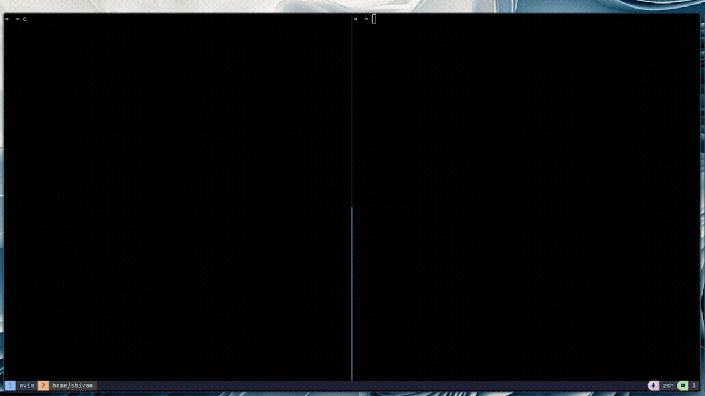

# Chat

A real-time TCP chat server built with Elixir. Create or join rooms with a 6-letter code and chat with anyone connected.

## Demo




## Connect to the Server

### Windows

1. Open PowerShell as Administrator and enable the Telnet client:

```powershell
Enable-WindowsOptionalFeature -Online -FeatureName TelnetClient
```

2. Restart PowerShell, then connect:

```powershell
telnet 129.121.101.6 4040
```

### macOS

```bash
# telnet is available by default on most macOS versions
telnet 129.121.101.6 4040
```

If `telnet` is not installed:

```bash
brew install telnet
```

### Linux

```bash
# using telnet
telnet 129.121.101.6 4040

# or using netcat
nc 129.121.101.6 4040
```

Install telnet if needed:

```bash
# Debian/Ubuntu
sudo apt install telnet

# Fedora
sudo dnf install telnet

# Arch
sudo pacman -S inetutils
```

## How It Works

1. Connect to the server
2. Choose `1` to create a room or `2` to join one
3. If creating — you'll get a 6-letter room code to share with others
4. If joining — enter the room code someone shared with you
5. Pick a nickname and start chatting

When the room creator disconnects, the room closes for everyone.

## Self-Hosting

### Prerequisites

- Erlang/OTP
- Elixir

### Build & Run

```bash
mix local.hex --force && mix local.rebar --force
MIX_ENV=prod mix release

# run on default port 4040
_build/prod/rel/chat/bin/chat start

# run on a custom port
CHAT_PORT=5000 _build/prod/rel/chat/bin/chat start

# run as a background daemon
CHAT_PORT=4040 _build/prod/rel/chat/bin/chat daemon
```

Make sure to open your chosen port in your OS firewall and any cloud security groups.

## Architecture

```
Chat.Supervisor
├── Chat.RoomSupervisor      # DynamicSupervisor for room processes
├── Chat.RoomRegistry        # Maps room codes to room PIDs, auto-cleans dead rooms
├── Chat.ConnectionSupervisor # DynamicSupervisor for client connections
└── Chat.Server              # TCP listener, spawns connections on accept
```

Each room is an isolated `GenServer` that holds its member list and handles broadcasting. Each client connection is its own `GenServer` with a state machine: `:choosing` → `:entering_code` / `:naming` → `:chatting`.

## Contributing

### Getting Started

1. Fork the repo
2. Clone your fork:

```bash
git clone https://github.com/your-username/chat.git
cd chat
```

3. Install dependencies:

```bash
mix deps.get
```

4. Run the server locally:

```bash
mix run --no-halt
```

5. Connect in another terminal:

```bash
telnet localhost 4040
```

### Making Changes

1. Create a branch for your work:

```bash
git checkout -b my-feature
```

2. Make your changes
3. Make sure it compiles cleanly:

```bash
mix compile --warnings-as-errors
```

4. Commit with a clear message describing what you changed and why
5. Push your branch and open a pull request

### Ideas for Contributions

- Private messaging between users in a room
- `/kick` and `/ban` commands for room creators
- Room capacity limits
- Chat history (show recent messages when joining)
- Timeout / auto-close for inactive rooms
- A web client using WebSockets
